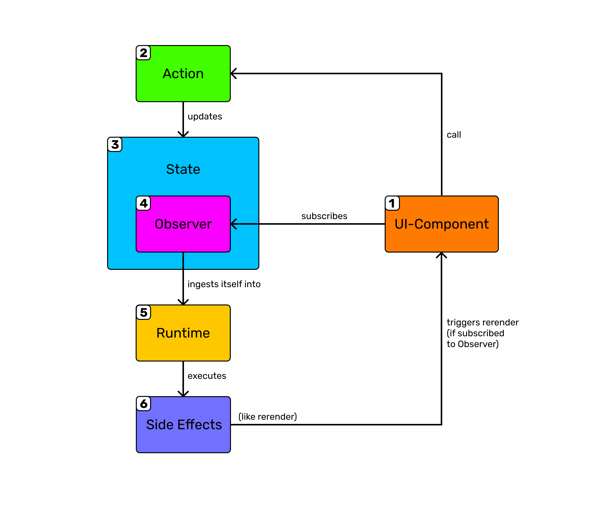

## 👋 Introduction {#introduction}

AgileTs is an atom based global State and Logic Library implemented in Typescript.
It offers a reimagined API that focuses on **developer experience**
and allows you to **easily** and **flexible** manage your application States.
Besides [States](../packages/core/api/state/Introduction.md), 
AgileTs offers some other powerful APIs that make your life easier,
such as [Collections](../packages/core/api/collection/Introduction.md) 
and [Computed States](../packages/core/api/computed/Introduction.md).
The philosophy behind AgileTs is simple:

### 🚅 Straightforward {#straightforward}

Write minimalistic, boilerplate-free code that captures your intent.
```ts
// Create State with the inital value 'frank'
const MY_STATE = createState('frank');

// Update the State value from 'frank' to 'jeff'
MY_STATE.set('jeff');

// Undo the latest State value change
MY_STATE.undo();

// Reset the State value to its initial value
MY_STATE.reset();

// Permanently store the State value in an external Storage
MY_STATE.persist({key: "storage-key"}); 
```

### 🤸‍ Flexible {#flexible}

- Works in nearly any UI-Framework (currently supported are [React](https://reactjs.org/), [React-Native](https://reactnative.dev/) and [Vue](https://vuejs.org/)).
- Surly behaves with the workflow that suits you best. 
  No need for _reducers_, _actions_, ..
- Has **0** external dependencies.

### ⛳️ Centralize {#centralize}

AgileTs is designed to take all business logic out of the UI-Components 
and put them in a central place, often called `core`.
The advantage of keeping logic separate to UI-Components,
is that your code is more decoupled, portable, scalable, 
and above all, easily testable.

You can learn more about ways to centralize your application logic with AgileTs
in our [Style Guides](./StyleGuides.md).

### 🎯 Easy to Use {#easy-to-use}

Learn the powerful tools of AgileTs in a short period of time. 
An excellent place to start are our [Quick Start Guides](./Installation.md), 
or if you don't like to follow tutorials,
you can jump straight into the [Example section](../examples/Introduction.md).


## ⏳ Quick Example {#quick-example}

Instead of talking too much about the benefits of using AgileTs,
we should rather see them in action.

### 😎 Create State {#create-state}

```tsx
// -- core.js ------------------------------------------

// 1️⃣ Create State with the initial value "Hello Friend!"
const MY_FIRST_STATE = createState("Hello Friend!");


// -- MyComponent.whatever ------------------------------------------

// 2️⃣ Bind initialized State to the desired UI-Component.
// And wolla, the Component is reactive. 
// Everytime the State mutates the Component re-renders.
const myFirstState = useAgile(MY_FIRST_STATE);
console.log(myFirstState); // Returns "Hello Friend!"
```
Want to learn how to implement AgileTs in your preferred UI-Framework? 
Check out our [Quick Start Guides](./Installation.md).

### ⛳️ Sandbox {#sandbox}

Test AgileTs yourself in a [codesandbox](https://codesandbox.io/s/agilets-first-state-f12cz).
It's only one click away. Just select your preferred UI-Framework below.

- [React](https://codesandbox.io/s/agilets-first-state-f12cz)
- [React-Native](https://snack.expo.io/@bennodev/agilets-first-state)
- [Vue](https://codesandbox.io/s/agilets-first-state-i5xxs)

More examples can be found in the [Example section](../examples/Introduction.md).

## 👨‍💻 When using AgileTs {#when-using-agilets}

AgileTs was built to manage the global states of your business logic 
and logic in general that isn't explicitly bound to a UI-Component.
This includes, for example, `server caching states` like the current logged-in user
or global `ui states` like the current theme of your application.
AgileTs was not intended to handle any states 
that belong to one single UI-Component like `isModalOpen`.

## 🟦 Typescript {#typescript}

AgileTs is 99% written in Typescript 
and offers an excellent type-safety.
```ts
const USER = createState<UserInterface | null>(null); // ✅
USER.set(123); // ❌
USER.set({id: 1, name: 'jeff'}); // ✅
```

## 👮 Data Flow {#data-flow}

We can summarize the flow of data through a AgileTs app with this diagram.
Below the diagram you can find an explanation for each station 
labeled with a `number`.



#### `1`

In State-Management, the Data-Flow more or less starts and ends in the UI-Component.
For example, if we click a Button, we trigger an action that resolves in a UI change.
So by clicking a Theme Button, we start an action that changes the color theme of the current site.
In order that this color change can visibly happen, the Component has to rerender.
For this, we need to subscribe/bind the State (`THEME_STATE`) to the UI-Component,
with, for instance, the `useAgile()` hook.
Such subscription is essential to rerender the Component whenever the subscribed State mutates.
```ts
// ..
onClick={() => {
    toggleTheme();
}}
// ..
```

#### `2`

The action, triggered by the Theme Button,
then mutates the actual `THEME_STATE` and might do some side calculations.
We can also omit this step and edit the State directly in the UI-Component.
Everyone as he likes. However, I prefer separating UI-Component logic from global/business logic.
```ts
const toggleTheme = () => {
  THEME_STATE.invert();
}
```

#### `3`

Now we come to the inner workings of AgileTs,
i.e. what the actual AgileTs user no longer sees from the outside.
After the State has been mutated, it will notify the Observer.
Each State has its own Observer, which serves as an Interface to the Runtime
and keeps track of the subscribed UI-Components.
```ts
// ..
THEME_STATE.ingestValue(/* new value of THEME_STATE */);
// ..
```

#### `4`

The Observer then creates a Job and passes it to the Runtime.
The created Job has a reference to the Observer itself in order to perform the actual action
and rerender the correct UI-Components.
```ts
// ..
AgileInstance.runtime.ingest(ThemeStateChangeJob);
// ..
```

#### `5`

The main task of the Runtime is to queue Jobs and avoid race conditions.
It also combines rerender tasks if multiple Jobs try to rerender the same Component.
Firstly the Runtime processes all pending Jobs by calling a function in the Observer, which mutates the actual State value.
Also, it collects the rerender tasks of the individual Jobs.
If there are no more pending Jobs, it starts processing the rerender tasks.
```ts
// ..
job.observer.perform(job);
jobsToRerender.push(job);
// ..
```

#### `6`

A side effect of running a Job is the rerendering of subscribed Components.
Another could be the persisting into a permanent Storage or rebuilding the [Group](../packages/core/api/collection/group/Introduction.md) output.
```ts
// ..
subscriptionContainer.callback(); // If Component based Subscription
// ..
```

## 👨‍🏫 Learn AgileTs {#learn-agilets}

We have a variety of resources available to help you learn AgileTs. 
An excellent place to start are our [Quick Start Guides](./Installation.md), 
where you learn the fundamentals about how to use AgileTs in your preferred UI-Framework. 
After knowing the ground concept of AgileTs, 
we recommend taking a look at our [Style Guides](./StyleGuides.md).
These will help you to get some inspiration 
on how to structure a scalable application using AgileTs. 
Now you are ready to use AgileTs wherever you want. 
If you need some more information about some functionalities of AgileTs,
use the search bar in the top right corner. 
And in case you have any further questions, 
don't hesitate to join our [Community Discord](https://discord.gg/T9GzreAwPH).

## 🏢 Structure of Documentation {#structure-of-documentation}

### 📁 AgileTs

You are currently in the `AgileTs` section, which serves as source for general topics like
the [Style Guide](./StyleGuides.md) or a basic [Installation Guide](./Installation.md).

### 📁 Quick Start

The `Quick Start` section is all about how to get AgileTs up and running in different environments
like [React](https://reactjs.org/) or [Vue](https://vuejs.org/). In each Quick Start Guide the basics of some AgileTs
classes (like the [State](../packages/core/api/state/Introduction.md)) are covered too.

### 📁 Packages

In the `packages` section all the AgileTs packages are listed and described in detail. 
For example, you can find detailed information about the [core](../packages/core/Introduction.md) and
the [react](../packages/react/Introduction.md) package there. 
If you click on one of these packages, it will reveal you an Introduction
about that package, an Installation Guide and a comprehensive API documentation. 
In case of the [core](../packages/core/Introduction.md)
package you find the [State](../packages/core/api/state/Introduction.md)
and [Collection](../packages/core/api/collection/Introduction.md) documentation under the API bullet point.
Note that `⚠️ WIP` isn't an actual package. 
It is intended to separate packages that are currently `work in progress`
and not ready for the production from the stable packages.

### 📁 Examples

Some interactive examples can be found in the `example` section.

### 📁 Interfaces

Without any context this section might be useless to you. 
As the name suggests, it's all about Typescript interfaces of AgileTs, 
which are outsourced for a better overview.
You might be redirected to parts of the Interface section from
other documentation parts. 
Often to learn some more about particular properties of an interface.

## 🤓 Glossary {#glossary}

In these docs, we will refer to our classes with a capital first letter.
For example, when you see 'state', we refer to the programming concept `state`,
but when you see 'State', we are referring to our [State](../packages/core/api/state/Introduction.md) class.

### `Agile Sub Instance`
Instances that hold a reference to the [`Agile Instance`](../packages/core/api/agile-instance/Introduction.md)
and depend on its functionalities.
- [States](../packages/core/api/state/Introduction.md)
- [Collections](../packages/core/api/collection/Introduction.md)
- [Groups](../packages/core/api/collection/group/Introduction.md)
- [Selectors](../packages/core/api/collection/selector/Introduction.md)
- [Computed States](../packages/core/api/computed/Introduction.md)

### `Observer`

An `Observer` can be seen as an interface to the [runtime](#runtime).
It keeps track of subscribed UI-Components, caches the State value represented by the UI
and performs the actual State mutation action executed by the runtime.

### `Runtime`

The `Runtime` ques and executes provided Observer Jobs
and performs their side effects such as re-rendering subscribed UI-Components.
The main reason AgileTs has its own runtime is to prevent race conditions
and batch re-renders.

## 💬 What others say {#what-others-say}

Actually, nothing, yet. If you want to be the first one, don't mind tweeting whatever you think about AgileTs.
But don't forget to tag [@AgileTypescript](https://twitter.com/AgileTypescript). Otherwise, we can't find your tweet.

## 🌏 History of AgileTs {#history-of-agilets}

After exploring the many options of Javascript State libraries, including the popular Redux and MobX.
I felt like I need a simpler, more straightforward solution.
One day I accidentally stumbled across a stream from [@jamiepine](https://twitter.com/jamiepine).
Jamie was using an interesting approach of State Management which I haven't seen yet.
The Library he used was called PulseJs, the ancestor of AgileTs, so to speak.

I liked this concept of State Management a lot and started using it in my own projects.
At this point in time (spring 2020), it wasn't officially released.
Therefore, it was quite buggy and had no documentation. But I figured out how to use it anyway
and saved my finding in a small [pre-documentation](https://www.notion.so/bennoworkspace/Pulse-v3-No-official-Docs-4e92e8d02dd3423582fa95072806cab6) 
for PulseJs fellows.

The months went by, and no stable version came out. Not even a npm package.
In July, I came to the conclusion to contribute to PulseJs, 
in order to speed up the development process a bit.
But before I could do anything, I had to figure out how PulseJs works internally.
After hours, I still haven't figured out how it works. 
This was mainly due to the fact that I was a Typescript noob,
and the codebase was (in my opinion) not very contributor friendly (not many comments, variables called x, sc, ..).
To learn how PulseJs works and to get a deeper understanding of Typescript,
I decided to rewrite PulseJs from scratch in a separate project, later AgileTs.
After a while, I got the hang and understood how PulseJs works under the hood.

Now that I knew how PulseJs works, I could finally start contributing.
My [first contribution](https://github.com/pulse-framework/pulse/commits?author=bennodev19) 
was on the 16th August 2020, where I refactored the `PulseHOC`. 
Unfortunately, PulseJs was moving further and further away 
from my idea of an ideal State Management Library.
For instance, they introduced the `Pulse.Core`,
which more or less forced you to define all States in a single source of truth object called `core`.
I wouldn't say I liked that change since I switched, among other reasons,
to PulseJs in order not to define all my States in a single object.
Because of this relatively significant design change, 
I would have to rebuild my entire State Management Logic of my applications.
Which I didn't want to do because I liked the old concept more.

Luckily I had the refactored PulseJs version lying around, 
which I created to learn how PulseJs works internally and released it as an own library called
[agile-architecture](https://www.npmjs.com/package/agile-architecture).
Agile-Architecture was at that point just an old refactored version of PulseJs without the `Pulse.Core`.
Another reason I turned away from PulseJs, besides the different visions, 
was the leak of organization. Some of my changes never got merged into the `master` branch. 
Why? Idk. But I am sure that it was not intentional.
For instance, I fixed an annoying `usePulse()` type issue, 
and eight months later, it is still not merged into the `master`.
Why should I contribute if my changes, which fixed a problem I had, 
will never be in a release version?

Now that I had my own State Management Library, I had more control and adapted it to my needs.
Over time AgileTs evolved away from PulseJs with other visions and goals.
During this time, I rewrote and optimized all internal classes, created tests, 
and wrote a documentation (to improve my writing skills and english).
Today AgileTs has only a similar syntax to PulseJs. Internal, it works quite differently.

**Conclusion:** The idea of AgileTs is based on PulseJs, 
and I would have loved to continue working on PulseJs.
But certain circumstances, such as a poor organization and different visions,
have driven me to write my own State Manager based on the excellent ground concept 
of PulseJs and other MVVM libraries.

## 🎉 Credits {#credits}

AgileTs is inspired by MVVM libraries like [MobX](https://mobx.js.org/README.html)
or [PulseJs](https://github.com/pulse-framework/pulse).

## ❓ Something missing {#something-missing}

If you find issues with the documentation or have suggestions on how to improve the documentation or the project in
general, please [file an issue](https://github.com/agile/agile-ts/issues) for us or join
our [Community Discord](https://discord.gg/T9GzreAwPH) and notice it in the `#issue` channel.
