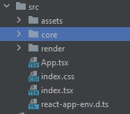
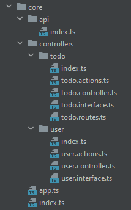

AgileTs isn't bound to any specific Style Guide. 
Below you can find a Suggestion that might help to find your perfect workflow.

## 🚀 Suggestion



In the suggested way using AgileTs we have a so called `core`. 
This core holds all our application logic. It's like the brain of our application
and handles our _Routes_, _States_, _Collections_, ..
This outsourcing of our Logic makes our code more decoupled, portable, and above all, easily testable.




:::note

The core you see here is from a simple TODO application.

:::

Let's take a look into our `core` folder. 
Uhh, more folders and files. <br />
But no panic we will go through them in detail.

## 📁 api

### 📝 index.ts

If we have an Application that has some communication to a backend. 
We can create our Agile API here, which is a simple Promise base API.

```ts title="index.ts"
import {API} from "@agile-ts/api";

const API = API({
    baseURL: 'http://localhost:5000',
    timeout: 10000,
    options: {
        credentials: undefined
    }
});

export default API;
```

## 📁 controllers

### 📝 index.ts

```ts
import * as actions from "./todo.actions";
import * as controller from "./todo.controller";
import * as routes from "./todo.routes";
import * as interfaces from "./todo.interface";

export default {
    ...actions,
    ...controller,
    ...routes,
    ...interfaces,
};
```

### 📝 .action.ts

```ts
import {ITodo} from './todo.interface';
import {ADD_TODO} from './todo.routes';

export const addTodo = async (userId: string, description: string): Promise<IError | null> => {

    // Api
    const response = await ADD_TODO({description: description, userId: userId});
    if ('error' in response) return response;
    const todo = response;

    // Core
    core.todos.collection.todos.collect(todo, userId);

    return null;
};

// ..

```

### 📝 .controller.ts

```ts
import {App} from '../../app';
import {ITodo} from './todo.interface';

// Collectiont that holds all _TODO'S
export const TODOS_COLLECTION = App.Collection<ITodo>()();

// Computed that only olds the _TODO's of the currently logged in User
export const USER_TODOS = App.Computed(() => {
    return TodosCollection.getGroup(user.state.value.id).output;
});

```

### 📝 .interface.ts

```ts
export interface ITodo {
	id: string
	userId: string
	description: string
	creationDate: string
}

```

### 📝 .routes.ts

```ts
import {ITodo} from "./todo.interface";
import API from "../../api";

interface IAddTodoPayload {
    description: string,
    userId: string
}

type TAddTodoResponse = ITodo | IError;

export const ADD_TODO = async (payload: IAddTodoPayload): Promise<ITodo> => {
    const response = await api.post('todos', payload);
    return response.data.body.todo;
}
```

## 📝 app.ts

```ts
import {Agile} from "@agile-ts/core";
import reactIntegration from "@agile-ts/react";

export const App = new Agile({ logJobs: true }).use(reactIntegration);
```

## 📝 index.ts

```ts
import todo from "./controllers/todo";
import user from "./controllers/user";
import {globalBind} from "@agile-ts/core";

const core = {
  todo: todo,
  user: user,
};

// If you want to see your core in the console (Don't do that in PRODUCTION!!)
globalBind("__core__", core);

export default core;
```


