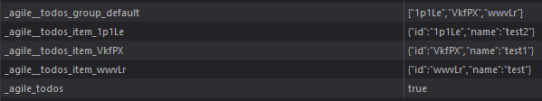

The `Storage Class` serves as an interface to external storages, such as the
[Async Storage](https://github.com/react-native-async-storage/async-storage) or
[Local Storage](https://www.w3schools.com/html/html5_webstorage.asp).
It creates the foundation to easily [`persist()`](../state/Methods.md#persist) [Agile Sub Instances](../../../../main/Introduction.md#agile-sub-instance) 
(like States or Collections) in nearly any external storage.
All you need to instantiate a Storage Interface, 
is to call `createStorage()` and specify some configurations.
```ts
const myStorage = createStorage(/* storage config */);
````
After a successful instantiation of the Storage Interface, 
we must register the Storage at the shared `Storage Manager`.
Otherwise, AgileTs doesn't know the Storage and therefore cannot store Instances in it.
The shared Storage Manager manages all Storages for AgileTs
and isn't instantiated by default due to tree shaking.
Thus, we need to instantiate a Storage Manager manually 
and specify it as shared Storage Manager.
```ts
const storageManager = createStorageManager({ localStorage: false });
assignSharedStorageManager(storageManager);
```
After we have successfully created a shared Storage Manager we can register
our just creation Storage at it using the [`registerStorage()`](../agile-instance/Methods.md#registerstorage) method.
```ts
storageManager.registerStorage(myStorage, {default: true});
```
Here we set the property `default` to `true`,
in order to use `myStorage` as the default Storage.
Each persisted Instance will then be stored in `myStorage` by default,
if no further configurations have been made.
```ts
// Is stored in 'myStorage'
MY_STATE.persist();

// Is stored in 'myStorage2'
MY_STATE.persist({storageKeys: ['myStorage2']}); 
```
When setting the property `localStorage` to `true`,
the [Local Storage](https://www.w3schools.com/html/html5_webstorage.asp) 
will be registered as `default` Storage by AgileTs
and can be used out of the box.
```ts
const storageManager = createStorageManager({ localStorage: true });
assignSharedStorageManager(storageManager);

// Is stored in the Local Storage
MY_STATE.persist();
```


## 💾 Example

### [`Async Storage`](https://github.com/react-native-async-storage/async-storage)
In a [react-native](https://reactnative.dev/) environment it is common to use the `Async Storage`.
The `Async Storage` isn't registered by default, so we have to do it ourselves.
```ts
// Create Storage Interface representing the Async Storage
const asyncStorage =  createStorage({
    key: "AsyncStorage",
    async: true,
    methods: {
        get: AsyncStorage.getItem,
        set: AsyncStorage.setItem,
        remove: AsyncStorage.removeItem,
    },
});

// Register the Async Storage Interface to AgileTs as default Storage
storageManager.registerStorage(asyncStorage, {default: true});
```
If we now `persist()`, for example, a State,
the State value will be stored in the `Async Storage`.
```ts
MY_STATE.persist();
```

### `Object Storage`
The `Object Storage` isn't an actual useful Storage, 
however it demonstrates the use of the `Storage Class` pretty good.
```ts
// Object Storage
const myStorage = {};

// Create Storage Interface representing the Object Storage
const objectStorage =  createStorage({
    key: "ObjectStorage",
    async: false,
    methods: {
        get: (key) => {
            return myStorage[key];
        },
        set: (key, value) => {
            myStorage[key] = value;
        },
        remove: (key) => {
            delete myStorage[key];
        },
    },
});

// Register the Object Storage Interface to AgileTs as the default Storage
storageManager.registerStorage(objectStorage, {default: true});
```

## 📭 Props

```ts
createStorage(config);
```

### `config`

A `Storage` takes a required configuration object as its only parameter.
```ts
createStorage( {
    key: "myStorage",
    methods: {
        get: () => {},
        set: () => {},
        remove: () => {},
    }
});
```
Here is a Typescript Interface for quick reference. However,
each property is explained in more detail below.
```ts
export interface CreateStorageConfigInterface extends StorageConfigInterface {
    key: string;
    methods: StorageMethodsInterface;
}

// or without extending

export interface CreateStorageConfigInterface {
    key: string;
    async?: boolean;
    prefix?: string;
    methods: {
        get: (key: string) => any;
        set: (key: string, value: any) => void;
        remove: (key: string) => void;
    }
}
```

<br/>

#### `key`

The required property `key/name` should be a unique `string/number` to identify the Storage later.
```ts
createStorage({
    key: "myStorage"
    // ..
});
```
This is especially important if we have several Storages in use
and want to decide which value is stored in which Storage.
```ts
// Store MY_STATE in 'myStorage'
MY_STATE.persist({storageKeys: ['myStorage']});

// Store MY_STATE_2 in 'myStorage2'
MY_STATE_2.persist({storageKeys: ['myStorage2']});
```

| Type               | Default     | Required |
|--------------------|-------------|----------|
| `string \| number` | undefined   | Yes      |

<br/>

#### `async`

Defines whether the Storage Interface has to work with an async storage
and should handle it accordingly.
```ts
createStorage({
    key: "asyncStorage",
    async: true
});
```
It is often not necessary to define the `async` property, 
since the Storage Interface is in the most cases able to find out with which kind of Storage it has to deal.

| Type                     | Default   | Required |
|--------------------------|-----------|----------|
| `boolean`                | false     | No       |

<br/>

#### `prefix`

The prefix will be added before each `Storage Key`
and is intended to highlight the items stored by AgileTs.
A `Storage Key` identifies the stored value in the corresponding Storage.
```ts
MY_STATE.persist({key: 'myState'});
// Storage Key: '_prefix_myState'

MY_COLLECTION.persist({key: 'myCollection'});
// Storage Keys: 
// Collection Indicator: '_prefix_myCollection'
// Default Group: '_prefix__myCollection_group_default'
// Item with id '1': '_prefix__myCollection_item_1'
// Item with id '2': '_prefix__myCollection_item_2'
```
In the below image you can see a simple Todo Collection stored in the `Local Storage` with the prefix 'agile'.


| Type                     | Default   | Required |
|--------------------------|-----------|----------|
| `string`                 | 'agile'   | No       |

<br/>

#### `methods.get`

Method used to get a specific value at `storageKey` from the external Storage.
```ts {4-7}
createStorage({
    // ..
    methods: {
        get: (key) => {
            console.log(`GET '${key}'`);
            return myStorage[key];
        },
        // ..
    }
});

myStorage.get("item1"); // console log: "GET 'item1'"
```

| Type                     | Default   | Required |
|--------------------------|-----------|----------|
| `(key: string) => any`   | undefined | Yes      |

<br/>

#### `methods.set`

Method used to set a specific value at `storageKey` into the external Storage.
```ts {4-7}
createStorage({
    // ..
    methods: {
        set: (key, value) => {
            console.log(`SET '${key}'`, value);
            myStorage[key] = value;
        }, 
        // ..
    }
});

myStorage.set("item1", {my: "value"}); // console log: "SET 'item1'" {my: "value"}
```

| Type                                  | Default   | Required |
|---------------------------------------|-----------|----------|
| `(key: string, value: any) => void`   | undefined | Yes      |

<br/>

#### `methods.remove`

Method used to remove a specific value at `storageKey` from the external Storage.
```ts {4-7}
createStorage({
    // ..
    methods: {
        remove: (key) => {
            console.log(`REMOVE '${key}'`);
            delete myStorage[key];
        },
        // ..
    }
});

myStorage.remove("item1"); // console log: "REMOVE 'item1'"
```

| Type                       | Default   | Required |
|----------------------------|-----------|----------|
| `(key: string) => void`    | undefined | Yes      |


## 🟦 Typescript

The `Storage Class` is almost 100% typesafe.
