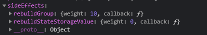

:::info

Here are valuable methods of the `State Class` listed.

:::

## `setKey()`

Use `setKey()` to assign a new key/name to a State.
```ts {1}
MY_STATE.setKey("newKey");
MY_STATE.key; // Returns 'newKey'
```

### ❓ Why a Key
We recommended giving each State a unique Key.
I promise you, it has only advantages. <br/>
Some of them are listed below:
- helps us during debug sessions
- makes it easier to identify a State
- no need for separate persist Key

### 📭 Props

| Prop           | Type                             | Default    | Description                                           | Required |
|----------------|----------------------------------|------------|-------------------------------------------------------|----------|
| `value`        | string \| number \| undefined    | undefined  | New Key/Name of State                                 | Yes      |

### 📄 Return

```ts
State
```
Returns the [State](./Introduction.md) it was called on.


<br />

---

<br />


## `set()`

We use the `set()` method to mutate the current `value` of the State.
```ts {1}
MY_STATE.set("myNewValue");
MY_STATE.value; // Returns 'myNewValue'
```
Under the hood, it ingests the State into the `runtime`,
which applies the new defined `value` to the State and ensures that each Component
which has bound the State (for instance with `useAgile()`) to itself rerender.

### 📭 Props

| Prop           | Type                                                                                | Default    | Description                                           | Required |
|----------------|-------------------------------------------------------------------------------------|------------|-------------------------------------------------------|----------|
| `value`        | ValueType = any                                                                     | undefined  | New State Value                                       | Yes      |
| `config`       | [StateIngestConfig](../../../../Interfaces.md#stateingestconfig)                    | {}         | Configuration                                         | No       |

### 📄 Return

```ts
State
```
Returns the [State](./Introduction.md) it was called on.


<br />

---

<br />


## `ingest()`

:::warning

This function is mainly thought for internal use.

:::

With `ingest()` we are able to ingest a State without any specific `value` into the `runtime`.
Instead of a passed value, like it does in the `set()` method,
it takes the `nextStateValue` as new State value.
```ts {2}
MY_STATE.nextStateValue = "frank";
MY_STATE.ingest(); // ingests State into runtime and takes the nextStateValue
MY_STATE.value; // Returns 'frank'
```
When we `ingest()` a specific extension of the State, it might behave quite different.
For instance, the [Computed State](../computed/Introduction.md) will take the value
generated with help of the `computed function` instead of the `nextStateValue`.
```ts {5}
let coolValue = "jeff";
const MY_COMPUTED = App.createComputed(() => coolValue); // Computed function returns 'jeff'
coolValue = "frank"; 
MY_COMPUTED.value; // Returns 'jeff'
MY_COMPUTED.ingest(); // ingest Computed into runtime and recomputes value
MY_COMPUTED.value; // Returns 'frank'
```

### 📭 Props

| Prop           | Type                                                                                | Default    | Description                                           | Required |
|----------------|-------------------------------------------------------------------------------------|------------|-------------------------------------------------------|----------|
| `config`       | [StateIngestConfig](../../../../Interfaces.md#stateingestconfig)                    | {}         | Configuration                                         | No       |

### 📄 Return

```ts
State
```
Returns the [State](./Introduction.md) it was called on.


<br />

---

<br />


## `type()`

:::info

If you are working with [Typescript](https://www.typescriptlang.org/), we recommend using generic types instead of the `type()` function.
```ts
const MY_STATE = createState<string>("hi");
MY_STATE.set(1); // type Erro
MY_STATE.set("bye"); // Success
```

:::

With the `type()` method, we can force the State to only accept specific values fitting to the before defined `type`.
Be aware that the `type` will be enforced at runtime and not in the editor.
```ts {1}
MY_STATE.type(String);
MY_STATE.set(1); // Error at runtime
MY_STATE.set("hi"); // Success at runtime
```
The type function takes in the JS constructor for that type. Possible options are:
```
Boolean, String, Object, Array, Number
```

### 📭 Props

| Prop           | Type                         | Default      | Description                                           | Required |
|----------------|------------------------------|--------------|-------------------------------------------------------|----------|
| `type`         | any                          | undefined    | Type that gets applied to the State                   | No       |

### 📄 Return

```ts
State
```
Returns the [State](./Introduction.md) it was called on.


<br />

---

<br />


## `hasCorrectType()`

:::info

Be aware that `hasCorrectType()` only compares the type with the type defined in the [`type()`](#type) method.
So if we haven't defined any `type` with help of the `type()` method,
this function returns always `true`.

:::

Checks if the given `value` has the same type as the previously defined type in the [`type()`](#type) method.
```ts {2,3}
MY_STATE.type(String);
MY_STATE.hasCorrectType("hi"); // Returns 'true'
MY_STATE.hasCorrectType(12); // Returns 'false'
```

### 📭 Props

| Prop           | Type                                                                                | Default    | Description                                           | Required |
|----------------|-------------------------------------------------------------------------------------|------------|-------------------------------------------------------|----------|
| `value`        | any                                                                                 | undefined  | Value that gets checked for its correct type          | Yes      |

### 📄 Return

```ts
boolean
```
Returns `true` whenever the value has the correct `type` or no type was defined
and `false` if the value doesn't fit to the defined `type`.


<br />

---

<br />


## `undo()`

Reserves the latest State value mutation.
```ts {3}
MY_STATE.set("hi"); // State Value is 'hi'
MY_STATE.set("bye"); // State Value is 'bye'
MY_STATE.undo(); // State Value is 'hi' 
```
Be aware that AgileTs can only reverse one State change at once.
That's why we can't do `undo().undo().undo()` to get to the State value from before 3 State changes.
But we have planned to add a feature called `history` in the future,
which will allow us to get the previous State of the previous State, ..

### 📭 Props

| Prop           | Type                                                                                | Default    | Description                                           | Required |
|----------------|-------------------------------------------------------------------------------------|------------|-------------------------------------------------------|----------|
| `config`       | [StateIngestConfig](../../../../Interfaces.md#stateingestconfig)                    | {}         | Configuration                                         | No       |

### 📄 Return

```ts
State
```
Returns the [State](./Introduction.md) it was called on.


<br />

---

<br />


## `reset()`

With the `reset()` method, we can reset the State.
A reset includes:
- setting the `value` to the `initialValue`
```ts {4}
const MY_STATE = App.createState("hi"); // State Value is 'hi'
MY_STATE.set("bye"); // State Value is 'bye'
MY_STATE.set("hello"); // State Value is 'hello'
MY_STATE.reset(); //️ State Value is 'hi' 
```

### 📭 Props

| Prop           | Type                                                                                | Default    | Description                                           | Required |
|----------------|-------------------------------------------------------------------------------------|------------|-------------------------------------------------------|----------|
| `config`       | [StateIngestConfig](../../../../Interfaces.md#stateingestconfig)                    | {}         | Configuration                                         | No       |

### 📄 Return

```ts
State
```
Returns the [State](./Introduction.md) it was called on.


<br />

---

<br />


## `patch()`

:::warning

Only relevant for States which have an `object` as a value type.

:::

`patch()` merges an `object with changes` into the current State value object **at top-level**.
```ts {2,5}
const MY_STATE = App.createState({id: 1, name: "frank"}); // State Value is '{id: 1, name: "frank"}'
MY_STATE.patch({name: "jeff"}); // State Value is '{id: 1, name: "jeff"}'

const MY_STATE_2 = App.createState(1);
MY_STATE.patch({hello: "there"}); // Error
```

### ❓ Deepmerge
Unfortunately the `patch()` function doesn't support `deep merges` yet.
As a conclusion, the merge only happens at the top-level of the objects.
If AgileTs can't find a particular property it will add it at the top-level of the State value object.
```ts {3}
const MY_STATE = App.createState({things: { thingOne: true, thingTwo: true }});
MY_STATE.patch({ thingOne: false }); // State Value is (see below)
// {things: { thingOne: true, thingTwo: true }, thingOne: false}
```
In case we don't want to add not existing properties to the State value object,
we can set `addNewProperties` to `false` in the configuration object.
```ts {3}
const MY_STATE = App.createState({things: { thingOne: true, thingTwo: true }});
MY_STATE.patch({ thingOne: true }, {addNewProperties: false}); // State Value is (see below)
// {things: { thingOne: true, thingTwo: true }}
```

### 📭 Props

| Prop                 | Type                                                     | Default    | Description                                           | Required |
|----------------------|----------------------------------------------------------|------------|-------------------------------------------------------|----------|
| `targetWithChanges`  | Object                                                   | undefined  | Object that gets merged into the current State Value  | Yes      |
| `config`             | [PatchConfig](../../../../Interfaces.md#patchconfig)     | {}         | Configuration                                         | No       |

### 📄 Return

```ts
State
```
Returns the [State](./Introduction.md) it was called on.


<br />

---

<br />


## `watch()`

`watch()` can be used to create a `callback` function, that observes the State.
The provided `callback` will be called on each State value mutation.
For instance if we change the State value from 'jeff' to 'hans'.
```ts {1-4}
const response = MY_STATE.watch((value, key) => {
    console.log(value); // Returns current State Value
    console.log(key); // Key of Watcher ("Aj2pB")
});

console.log(response); // "Aj2pB" (Random generated Key to identify the watcher callback)
```
We recommend giving each `watcher` callback a unique `key` to properly identify it later.
```ts {1}
const something = MY_STATE.watch("myKey", (value) => {
  // do something
});

console.log(response); // State Instance it was called on
```
For instance, we need to identify the `watcher` callback,
whenever we want to clean it up.

### ❓ Why cleanup
If we use the `watch()` method in a UI-Component,
it's pretty important to [clean up](#removewatcher) the callback whenever the Component unmounts.
Otherwise, the watcher remains and might cause memory leaks.
```ts
MY_STATE.removeWatcher(cleanupKey);
```

### 🚀 [`useWatcher`](../../../react/features/Hooks.md#usewatcher)
In case you use React and want to `watch` a State in a UI-Component without worrying about cleaning it up.
You can use the `useWatcher()` hook, which takes care of the cleanup, whenever the Component unmounts.
```tsx
export const MyComponent = () => {

  useWatcher(MY_STATE, (value) => {
    // do something
  })

  return <div></div>;
}
```

### 📭 Props

| Prop                 | Type                                                     | Default    | Description                                                          | Required |
|----------------------|----------------------------------------------------------|------------|----------------------------------------------------------------------|----------|
| `key`                | string \| number                                         | undefined  | Key/Name of Watcher Callback                                         | No       |
| `callback`           | (value: ValueType) => void                               | undefined  | Callback Function that gets called on every State Value change       | Yes      |

### 📄 Return

```ts
State
```
Returns the [State](./Introduction.md) it was called on, if we provide a unique `key`.
Otherwise, it generates a random `key` and returns this.


<br />

---

<br />


## `removeWatcher()`

With `removeWatcher()`, we can remove a `watcher` callback at a specific `key`.
We should always cleanup/remove `watcher` callbacks, which aren't in use anymore to avoid memory leaks.
For instance, if a UI-Component has been unmounted in which the `watcher` callback was located.
```ts
MY_STATE.removeWatcher("myKey");
```

### 📭 Props

| Prop   | Type   | Default    | Description                                           | Required |
|--------|--------|------------|-------------------------------------------------------|----------|
| `key`  | string | undefined  | Key/Name of Watcher Callback that gets removed        | Yes      |

### 📄 Return

```ts
State
```
Returns the [State](./Introduction.md) it was called on.


<br />

---

<br />


## `hasWatcher()`

Checks if a `watcher` callback/function exists at a certain `key`.
```ts {4,5}
MY_STATE.watch("myKey", (value) => {
  // do something
});
MY_STATE.hasWatcher("myKey"); // Returns 'true'
MY_STATE.hasWatcher("unknownKey"); // Returns 'false'
```

### 📭 Props

| Prop   | Type   | Default    | Description                                           | Required |
|--------|--------|------------|-------------------------------------------------------|----------|
| `key`  | string | undefined  | Key/Name of Watcher                                   | Yes      |

### 📄 Return

```ts
boolean
```
Returns `true` if the watcher callback exists and `false` if the watcher callback doesn't exist.


<br />

---

<br />


## `onInaugurated()`

`onIngurated()` is a [watcher callback](#watch) which destroys itself after invoking.
```ts
MY_STATE.onInaugurated((value) => {
  // do something
});
```

### 📭 Props

| Prop                 | Type                                                     | Default    | Description                                                                        | Required |
|----------------------|----------------------------------------------------------|------------|------------------------------------------------------------------------------------|----------|
| `callback`           | (value: ValueType) => void                               | undefined  | Callback Function that gets called once when the State Value got instantiated      | Yes      |

### 📄 Return

```ts
State
```
Returns the [State](./Introduction.md) it was called on.


<br />

---

<br />


## `persist()`

Preserves State Value in the appropriate local Storage for the current environment.
No matter if Mobile or Web environment as long as the [Storage](../storage/Introduction.md) Interface is configured correctly.
```ts
MY_STATE.perist("myPersistKey");
```

### 💻 Web
In a web environment it is common to use the [Local Storage](https://www.w3schools.com/html/html5_webstorage.asp) to permanently store a specific value
Luckily AgileTs has already set up the Local Storage by default.
```ts {2}
const App = new Agile({
  localStorage: true
})
```
So we can use the `persist()` method out of the box.

### 📱 Mobile
In a mobile environment the Local Storage doesn't exist,
so we need an alternative like the [Async Storage](https://reactnative.dev/docs/asyncstorage).
The Async Storage isn't setup by default, so we need create a [Storage](../storage/Introduction.md) Interface
and register it to AgileTs on our own.
```ts {3-9}
App.registerStorage(
  App.createStorage({
    key: "AsyncStorage",
    async: true,
    methods: {
      get: AsyncStorage.getItem,
      set: AsyncStorage.setItem,
      remove: AsyncStorage.removeItem,
    },
  }), {default: true}
);
```

### 🔑 Local Storage Key
To persist a State, we need a `storage key`, which is used to identify the stored value later.
There are two ways to provide such required `storage key` to the `persist()` method.

- **1.** Assign a unique key to the State itself.
  Because if no key is given to the `persist()` function,
  it takes the State key as `storage key`.
  ```ts {2}
  MY_STATE.key = "myCoolKey";
  MY_STATE.persist(); // Success
  ```
- **2.** Pass the `storage key` directly into the `persist()` function.
  ```ts {1}
  MY_STATE.persist("myCoolKey"); // Success
  ```

If AgileTs couldn't find any key that could be used as a `storage key`,
it throws an error and doesn't persist the State value.
```ts {2}
MY_STATE.key = undefined;
MY_STATE.persist(); // Error
```

### 📝 Multiple Storages
Sometimes we may store States in different Storages.
For example, State A should be stored in Storage B, and State B should be stored in Storage A.
Therefore, we can use `storageKeys` to define in which specific Storage the State value should be persisted.
```ts {2}
MY_STATE.persist({
storageKeys: ["myCustomStorage"]
})
```
By `default`, it will be stored in the `default` Storage.

### 📭 Props

| Prop                 | Type                                                                       | Default    | Description                                                                     | Required |
|----------------------|----------------------------------------------------------------------------|------------|---------------------------------------------------------------------------------|----------|
| `key`                | string \| number                                                           | undefined  | Key/Name of created Persistent (Note: Key required if State has no set Key!)    | No       |
| `config`             | [StatePersistentConfig](../../../../Interfaces.md#statepersistentconfig)   | {}         | Configuration                                                                   | No       |

### 📄 Return

```ts
State
```
Returns the [State](./Introduction.md) it was called on.


<br />

---

<br />


## `onLoad()`

With `onLoad()` we can register a callback that will be called whenever our [persisted](#persist) State value has been loaded into the State.
```ts
MY_STATE.onLoad((success) => {
console.log(`Value '${MY_STATE.value}' got loaded into the Collection! Success? ${success}`)
});
```
This can be useful, for instance, to show a loading indicator until
the persisted value has been loaded into the State.


### 📭 Props

| Prop                 | Type                                                     | Default    | Description                                                                                   | Required |
|----------------------|----------------------------------------------------------|------------|-----------------------------------------------------------------------------------------------|----------|
| `callback`           | (success: boolean) => void                               | undefined  | Callback Function that gets called once, when the Storage Value got loaded into the State     | Yes      |

### 📄 Return

```ts
State
```
Returns the [State](./Introduction.md) it was called on.


<br />

---

<br />


## `copy()`

Creates a fresh copy of the current State value, without any reference to the original value.
```ts {2}
const MY_STATE = App.createState([1, 2, 3]);
const myCopy = MY_STATE.copy(); // Returns '[1, 2, 3]'
myCopy.push(4); // myCopy value is '[1, 2, 3, 4]'
MY_STATE.value; // Returns '[1, 2, 3]'
```

### 📄 Return

```ts
ValueType // By default any
```


<br />

---

<br />


## `exists()`

Checks if the State exists.
```ts {2}
const MY_STATE = App.createState("hi");
MY_STATE.exists; // Returns 'true'
```
Criteria for an existing State are:
- State is no `placeholder`
- [`computeExists`](#computeexists) method returns `true`

### 📄 Return

```ts
boolean
```


<br />

---

<br />


## `computeExists()`

With `computeExists()`, we can change the exists check function,
which is called on every [`exists()`](#exists) call to determine whether the State exists or not.
```ts
MY_STATE.computeExists((value) => value !== undefined && value !== 'jeff');
```
The default `computeExists` function simply checks if the State is `null` or `undefined`.
```ts
(value) => {
    return value != null;
};
```

### 📭 Props

| Prop                 | Type                                                     | Default    | Description                                                                                   | Required |
|----------------------|----------------------------------------------------------|------------|-----------------------------------------------------------------------------------------------|----------|
| `method`             | (value: ValueType) => boolean                            | undefined  | Method which computes if a State exists                                                       | Yes      |


### 📄 Return

```ts
State
```
Returns the [State](./Introduction.md) it was called on.


<br />

---

<br />


## `is()`

Checks if the State value `is equal` to the provided value.
Equivalent to `===`.
```ts {2,3}
const MY_STATE = App.createState("hi");
MY_STATE.is("bye"); // Returns 'false'
MY_STATE.is("hi"); // Returns 'true'
```

### 📭 Props

| Prop                 | Type                     | Default    | Description                                                  | Required |
|----------------------|--------------------------|------------|--------------------------------------------------------------|----------|
| `value`              | ValueType (any)          | undefined  | value that gets checked if its equals to the State Value     | Yes      |

### 📄 Return

```ts
boolean
```


<br />

---

<br />


## `isNot()`

Checks if the State value `isn't equal` to the provided value.
Equivalent to `!==`.
```ts {2,3}
const MY_STATE = App.createState("hi");
MY_STATE.isNot("bye"); // Returns 'true'
MY_STATE.isNot("hi"); // Returns 'false'
```

### 📭 Props

| Prop                 | Type                     | Default    | Description                                                  | Required |
|----------------------|--------------------------|------------|--------------------------------------------------------------|----------|
| `value`              | ValueType (any)          | undefined  | value that gets checked if its not equals to the State Value | Yes      |

### 📄 Return

```ts
boolean
```


<br />

---

<br />


## `invert()`

:::warning

Only relevant for States with a `boolean` as value type.

:::

Inverts the current State value.
```ts {2}
const MY_STATE = App.createState(true);
MY_STATE.invert(); // State Value is 'false'
```

### 📄 Return

```ts
State
```
Returns the [State](./Introduction.md) it was called on.


<br />

---

<br />


## `computeValue()`

Use `computeValue()` whenever you need adjust the State on each State value change.
```ts {1}
const MY_STATE = App.createState("Jeff").compute((value) => `Hello '${value}'`);
MY_STATE.value; // Returns "Hello 'Jeff'"
MY_STATE.set("Frank");
MY_STATE.value; // Returns "Hello 'Frank'"
```

### ⚙️ [Computed](../computed/Introduction.md) vs `computeValue()`

The `computeValue()` method is a simple method that computes the value of a specific State.
The [Computed Class](../computed/Introduction.md) on the other hand
is mainly intended to compute a value based on several Agile Sub Instances like States, Collections, ..
```ts
const isAuthenticated = App.Computed(() => {
  return authToken.exists && user.exists && !timedout.value;
});
```
A Computed recomputes its value whenever a dependency value changes, not when its own value has mutated.

### 📭 Props

| Prop                 | Type                                                     | Default    | Description                                                                                   | Required |
|----------------------|----------------------------------------------------------|------------|-----------------------------------------------------------------------------------------------|----------|
| `method`             | (value: ValueType) => ValueType                          | undefined  | Method which recomputes the State value                                                       | Yes      |


### 📄 Return

```ts
State
```
Returns the [State](./Introduction.md) it was called on.


<br />

---

<br />


## `addSideEffect()`

:::warning

This function is mainly thought for internal use.

:::

With `addSideEffect` a `callback` function can be created,
which is executed during the `runtime` as a side effect of the State.
So whenever the `value` of the State changes.
```ts
MY_STATE.addSideEffect('mySideEffect', (state, config) => {
    // sideEffect callback
});
```
Each State can have multiple `sideEffects` with different `weights`.
```ts {3}
MY_STATE.addSideEffect('mySideEffect', (state, config) => {
  // sideEffect callback
}, {weigth: 10});
```
The `weight` determines in which order the `sideEffects` are executed,
since some `sideEffects` have to be performed before others.
The higher the `weigth`, the earlier the `sideEffect` will be executed.

### 👾 Example

For instance, a `persisted Group` has two `sideEffects`.



- `rebuildGroup` with a weight of `10`, which rebuilds the Group `output`.
- `rebuildStateStorageValue` with a weight of `0`, which updates the persisted Group `value` in the desired Storage.


### 📭 Props

| Prop                 | Type                                                                            | Default    | Description                                                          | Required |
|----------------------|---------------------------------------------------------------------------------|------------|----------------------------------------------------------------------|----------|
| `key`                | string \| number                                                                | undefined  | Key/Name of sideEffect Callback                                      | Yes      |
| `callback`           | (instance: Instance, properties?: object) => void                               | undefined  | Callback Function that gets called on every State Value change       | Yes      |
| `config`             | [AddSideEffectConfigInterface](../../../../Interfaces.md#addsideeffectconfig)   | {}         | Configuration                                                        | No       |

### 📄 Return

```ts
State
```
Returns the [State](./Introduction.md) it was called on.


<br />

---

<br />


## `removeSideEffect()`

:::warning

This function is mainly thought for internal use.

:::

Remove a `sideEffect` callback at a specific `key`.
```ts
MY_STATE.removeSideEffect("myKey");
```

### 📭 Props

| Prop   | Type   | Default    | Description                                           | Required |
|--------|--------|------------|-------------------------------------------------------|----------|
| `key`  | string | undefined  | Key/Name of sideEffect Callback that gets removed     | Yes      |

### 📄 Return

```ts
State
```
Returns the [State](./Introduction.md) it was called on.


<br />

---

<br />


## `hasSideEffect()`

:::warning

This function is mainly thought for internal use.

:::

Checks if a `sideEffect` callback/function exists at a certain `key`.
```ts {4,5}
MY_STATE.addSideEffect("myKey", (value) => {
  // do something
});
MY_STATE.hasSideEffect("myKey"); // Returns 'true'
MY_STATE.hasSideEffect("unknownKey"); // Returns 'false'
```

### 📭 Props

| Prop   | Type   | Default    | Description                                           | Required |
|--------|--------|------------|-------------------------------------------------------|----------|
| `key`  | string | undefined  | Key/Name of Watcher                                   | Yes      |

### 📄 Return

```ts
boolean
```
Returns `true` if the sideEffect callback exists and `false` if the sideEffect callback doesn't exist.
