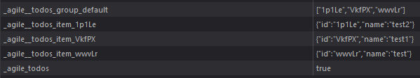

The `Storage Class` serves as an interface to external Storages, like the
[Async Storage](https://github.com/react-native-async-storage/async-storage) or
[Local Storage](https://www.w3schools.com/html/html5_webstorage.asp).
It creates the foundation to [`persist()`](../state/Methods.md#persist) Agile Sub Instances (like States or Collections) in nearly any Storage.
We instantiate a Storage Interface with help of an instantiated [Agile Instance](../agile-instance/Introduction.md) often called `App`.
```ts
const myStorage = App.createStorage(/* storage config */);
```
After a successful instantiation, we can register the Storage at AgileTs using the [`registerStorage()`](../agile-instance/Methods.md#registerstorage) method.
```ts
App.registerStorage(myStorage, {default: true});
```
Here we set the property `default` to `true`,
in order to use `myStorage` as default Storage.
Each persisted Instance will then be stored in `myStorage` by default,
if no further configurations have been made.
```ts
MY_STATE.persist(); // Gets stored in 'myStorage'
MY_STATE.persist({storageKeys: ['myStorage2']}); // Gets stored in 'myStorage2'
```
When setting the property `localStorage` to `true`,
the [Local Storage](https://www.w3schools.com/html/html5_webstorage.asp) will be registered as `default` Storage by AgileTs
and can be used out of the box.
```ts
const App = new Agile({localStorage: true});
```


## 💾 Example

### [`Async Storage`](https://github.com/react-native-async-storage/async-storage)
In a [react-native](https://reactnative.dev/) environment it is common to use the `Async Storage`.
The `Async Storage` isn't registered by default, so we have to do that ourselves.
```ts
// Create Storage Interface representing the Async Storage
const asyncStorage =  App.createStorage({
    key: "AsyncStorage",
    async: true,
    methods: {
        get: AsyncStorage.getItem,
        set: AsyncStorage.setItem,
        remove: AsyncStorage.removeItem,
    },
});

// Register the Async Storage Interface to AgileTs as default Storage
App.registerStorage(asyncStorage, {default: true});
```
If we now `persist()` for example, a State.
The State value will be stored in the `Async Storage`.
```ts
MY_STATE.persist();
```


## 📭 Props

```ts
App.createStorage(config);
```

### `config`

A `Storage` takes a required configuration object as its only parameter.
```ts
App.createStorage( {
    key: "myStorage",
    methods: {
        get: () => {},
        set: () => {},
        remove: () => {},
    }
});
```
Here is a Typescript Interface for quick reference. However,
each property is explained in more detail below.
```ts
export interface CreateStorageConfigInterface extends StorageConfigInterface {
    key: string;
    methods: StorageMethodsInterface;
}

// or without extending

export interface CreateStorageConfigInterface {
    key: string;
    async?: boolean;
    prefix?: string;
    methods: {
        get: (key: string) => any;
        set: (key: string, value: any) => void;
        remove: (key: string) => void;
    }
}
```

<br/>

#### `key`

The optional property `key/name` should be a unique `string/number` to identify the Storage later.
```ts
App.createStorage({
    key: "myStorage"
    // ..
});
```
This is especially important if we have several Storages in use
and want to decide which value is stored in which Storage.
```ts
// Store MY_STATE in 'myStorage'
MY_STATE.persist({storageKeys: ['myStorage']});

// Store MY_STATE_2 in 'myStorage2'
MY_STATE_2.persist({storageKeys: ['myStorage2']});
```

| Type               | Default     | Required |
|--------------------|-------------|----------|
| `string \| number` | undefined   | Yes      |

<br/>

#### `async`

Defines whether the Storage Interface must deal with an async storage
and should handle it accordingly.
```ts
App.createStorage({
    key: "asyncStorage",
    async: true
});
```
If we aren't 100% sure whether we are dealing with an async Storage,
we should omit the async property.
Because the Storage Interface is, in most cases, able to find out on its own,
if it has to deal with an async Storage.

| Type                     | Default   | Required |
|--------------------------|-----------|----------|
| `boolean`                | false     | No       |

<br/>

#### `prefix`

The prefix will be added before each `Storage Key`.
```ts
MY_STATE.persist('myState');
// Storage Key: '_prefix_myState'

MY_COLLECTION.persist('myCollection');
// Storage Keys: 
// Collection Indicator: '_prefix_myCollection'
// Default Group: '_prefix__myCollection_group_default'
// Item with id '1': '_prefix__myCollection_item_1'
// Item with id '2': '_prefix__myCollection_item_2'
```
A `Storage Key` identifies the stored value in the corresponding Storage.
A simple Todo Collection is stored in the `Local Storage` with the prefix 'agile' in the below image.


| Type                     | Default   | Required |
|--------------------------|-----------|----------|
| `string`                 | 'agile'   | No       |

<br/>

#### `methods.get`

Method to get a specific value at `primaryKey` from the external Storage.
```ts
myStorage.get("item1"); // Calls the here defined get method
```

| Type                     | Default   | Required |
|--------------------------|-----------|----------|
| `(key: string) => any`   | undefined | Yes      |

<br/>

#### `methods.set`

Method to set a specific value at `primaryKey` into the external Storage.
```ts
myStorage.set("item1", {my: "value"}); // Calls the here defined set method
```

| Type                                  | Default   | Required |
|---------------------------------------|-----------|----------|
| `(key: string, value: any) => void`   | undefined | Yes      |

<br/>

#### `methods.remove`

Method to remove a specific value at `primaryKey` from the external Storage.
```ts
myStorage.remove("item1"); // Calls the here defined remove method
```

| Type                       | Default   | Required |
|----------------------------|-----------|----------|
| `(key: string) => void`    | undefined | Yes      |