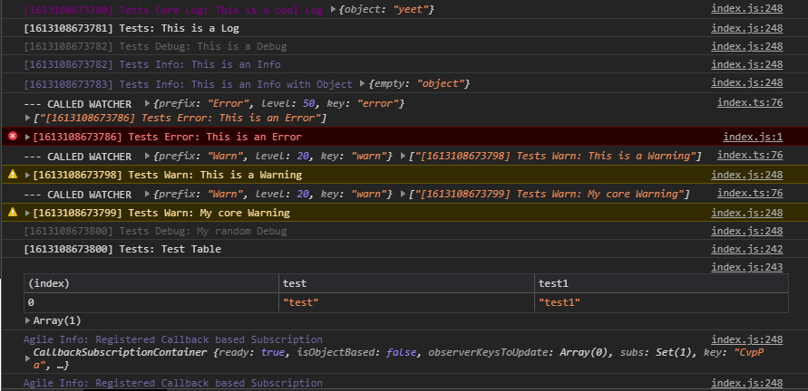

 <a href="https://github.com/agile-ts/agile">
  </a>
<a href="https://npm.im/@agile-ts/logger">
  </a>
<a href="https://npm.im/@agile-ts/logger">
  </a>
<a href="https://npm.im/@agile-ts/logger">
  </a>

<br />
<br />

> Simple Javascript Logger

## ❓ `logger`

The `logger` package is a standalone extension for AgileTs that improves the logging experience,
by letting you precisely configure the logging behavior of AgileTs packages.
Without the `logger` package installed, AgileTs only logs `warn` and `error` log messages.
These logs cannot be customized or turned off.
However, with the `logger` extension installed,
you can completely customize what messages should be logged,
how these messages should look like and much more.
All you need to do to configure the logging behavior of AgileTs,
is to call `assignSharedLogger()` and specify your customized logger configuration.
```ts
import {assignSharedLogger, createLogger, Logger} from '@agile-ts/logger';

assignSharedLogger(createLogger({
  active: true,
  level: Logger.level.DEBUG,
  timestamp: true
}));
```

## ✍️ Standalone

The AgileTs `Logger Class` can also be used without AgileTs installed.
```ts
const logger = new Logger();
```
Some of its basic capabilities are to:

- ### 🎭 categorize log messages
  Log messages in different upper categories
  to be able to roughly classify log messages.
  ```ts
  logger.log("I'm a log message!");
  logger.debug("I'm a debug message!");
  logger.info("I'm a info message!");
  logger.warn("I'm a warn message!");
  logger.error("I'm a error message!");
  logger.success("I'm a success message!");
  logger.trace("I'm a trace message!");
  logger.custom('jeff', "I'm a custom jeff message!");
  ```

- ### 🎲 filter log messages
  Filter log messages by `tag` or `type`
  in order to see only logs that matter right now.
  ```ts
  // Filter by 'type'
  logger.setLevel(Logger.level.WARN);
  logger.debug('Boring Debug Message.'); // Doesn't get logged
  logger.warn('Important Warning!'); // Does get log
  
  // Filter by 'tags'
  logger.if.tag(['runtime']).info(`Created Job '${job._key}'`, job);
  ```

- ### 🎨 style log messages `(color, font-weight)`
  Style log messages to make it easier to distinguish between different log types
  and recognise important log messages more quickly.
  

- ### 🔨 customize log messages `(prefix, timestamp)`
  Customize log messages to identify searched logs more swiftly.
  ```ts
  logger.debug('Hello there!'); // Logs: 'Agile: Hello there!'
  ```

- ### 🚫 disable all log messages
  ```ts
  logger.debug('Exciting Debug Message.'); // Logs: 'Boring Debug Message.'
  logger.isActive = false;
  logger.debug('Boring Debug Message.'); // Doesn't get logged
  logger.warn('Important Warning!'); // Doesn't get logged
  ```


## 📭 Props

```ts
// Stand alone Logger
new Logger(config);

// AgileTs Logger
assignSharedAgileLoggerConfig(config);
```

### `config`

The `Logger Class` takes an optional configuration object as its only parameter.
```ts
new Agile({
  active: true,
  level: Logger.level.DEBUG,
  timestamp: true
});
```
Here is a Typescript Interface for quick reference. However,
each property is explained in more detail below.
```ts
export interface CreateLoggerConfigInterface {
  prefix?: string;
  allowedTags?: LoggerKey[];
  canUseCustomStyles?: boolean;
  active?: boolean;
  level?: number;
  timestamp?: boolean;
}
```

<br/>

#### `prefix`

Prefix which is added before each log message.
```ts {2}
const logger = new Logger({
    prefix: "MyLog"
});

logger.debug("Jeff"); // Logs 'MyLog Debug: Jeff'
```
The log messages of AgileTs have the default prefix "Agile".

| Type               | Default   | Required |
|--------------------|-----------|----------|
| `string`           | "Agile"   | No       |

<br/>

#### `level`

The `log level` controls which kind of log messages are allowed to be logged.
Therefore, it is used to filter log messages to only see these relevant to us.
For example, we won't often set the `log level` to `debug`
since debug messages flood the console and are, in most cases, not relevant for us.
```ts {2}
const logger = new Logger({
    level: Logger.level.WARN
});

logger.debug("Jeff"); // Doesn't get logged
logger.warn("A important Warning"); // Gets logged
```
The `Logger Class` supports some hard-coded log levels, which can be set dynamically.
```ts
{
    TRACE: 1,
    DEBUG: 2,
    LOG: 5,
    TABLE: 5,
    INFO: 10,
    SUCCESS: 15,
    WARN: 20,
    ERROR: 50,
}

Logger.level.LOG; // 5
```
For example, suppose we set the logger level to `INFO`. In that case,
each log category at a higher or same level is printed to the console.
In the case of `INFO`, that would be `SUCCESS`, `WARN`, `ERROR` and of course `INFO`.

| Type               | Default   | Required |
|--------------------|-----------|----------|
| `number`           | 20        | No       |

<br/>

#### `active`

Determines whether the logger is `active` and is allowed to print messages to the console.
```ts {2}
const logger = new Logger({
    active: false
});

logger.log("Jeff"); // Doesn't get logged
logger.isActive = true;
logger.log("Jeff"); // Gets logged
```

| Type               | Default   | Required |
|--------------------|-----------|----------|
| `boolean`          | true      | No       |

<br/>

#### `timestamp`

If `true`, a timestamp is added before each log message.
This timestamp represents the time the message was logged.
```ts {2}
const logger = new Logger({
    timestamp: true
});

logger.debug("Jeff"); // Logs '[1613108673781] Debug: Jeff'
```

| Type               | Default   | Required |
|--------------------|-----------|----------|
| `boolean`          | false     | No       |

<br/>

#### `allowedTags`

Sometimes logging can be very confusing and overwhelming if the console is flooded with logs that don't matter at the time.
Therefore, `tags` got created which filter logs specifically by tags.
```ts {2}
const logger = new Logger({
    allowedTags: ["jeff", "hans"]
});

logger.debug("Jeff"); // Gets logged
logger.if.tag(["jeff"]).debug("Jeff"); // Doesn't get logged
logger.if.tag(["hans", "jeff"]).debug("Jeff");; // Gets get logged
logger.if.tag(["hans"]).debug("Jeff");; // Doesn't get logged
logger.if.tag(["hans", "frank"]).debug("Jeff");; // Doesn't get logged
```
Any log message with defined tags will only be logged if all its tags are allowed in the `Logger Class`.
Logs that have no condition/tag are always logged.

| Type               | Default                                                   | Required |
|--------------------|-----------------------------------------------------------|----------|
| `string[]`         | ['runtime', 'storage', 'subscription', 'multieditor']     | No       |

<br/>

#### `canUseCustomStyles`

Whether we can apply custom `css` styles to the log messages.


For example, AgileTs Logs are by default purple.

| Type               | Default   | Required |
|--------------------|-----------|----------|
| `boolean`          | true      | No       |


## 🟦 Typescript

The `Logger` is almost 100% typesafe.


## 🚀 Quick Links
- [Installation](./Installation.md)
